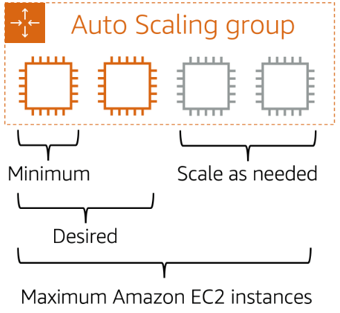
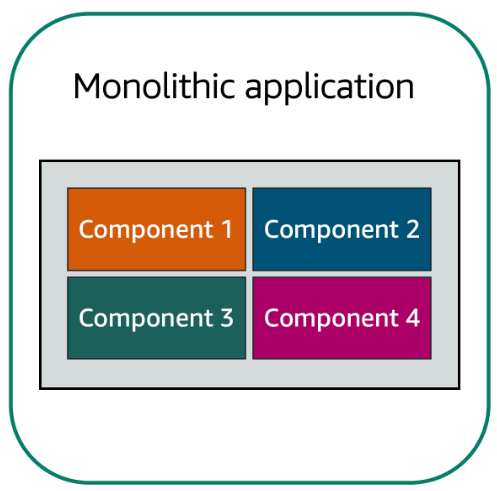
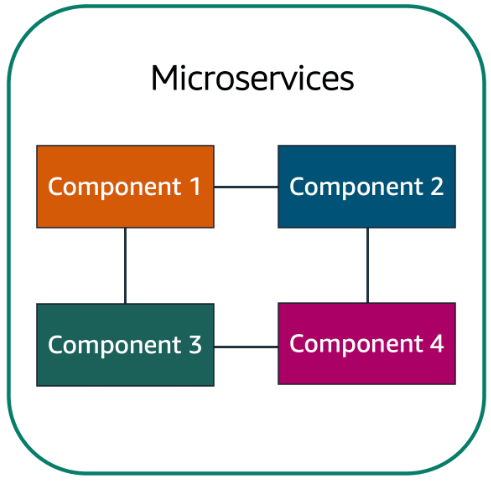
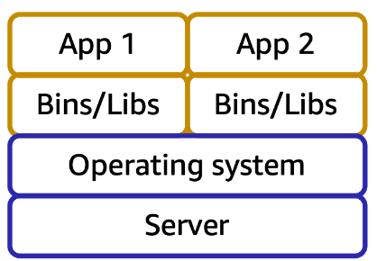
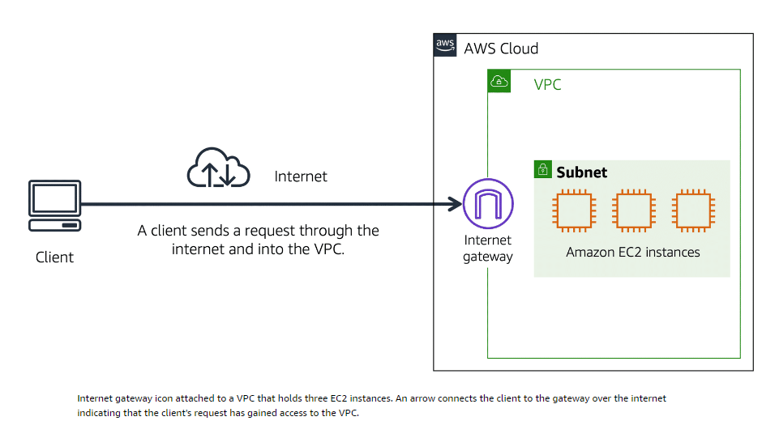

# instance type 

## general purpose 
    General purpose instances provide a balance of compute, memory, and networking resources. You can use them for a variety of workloads, such as:

       - application servers
       - gaming servers
       - backend servers for enterprise applications
       - small and medium databases

    For instance an application in which the resource needs for compute, memory, and networking are roughly equivalent. You might consider running it on a general purpose instance because the application does not require optimization in any single resource area.

## compute optimized instances 

    Compute optimized instances are ideal for compute-bound applications that benefit from high-performance processors. Like general purpose instances, you can use compute optimized instances for workloads such as web, application, and gaming servers.

    However, the difference is compute optimized applications are ideal for high-performance web servers, compute-intensive applications servers, and dedicated gaming servers. You can also use compute optimized instances for batch processing workloads that require processing many transactions in a single group.

## memory optimized instances 

    Memory optimized instances are designed to deliver fast performance for workloads that process large datasets in memory. In computing, memory is a temporary storage area. It holds all the data and instructions that a central processing unit (CPU) needs to be able to complete actions. Before a computer program or application is able to run, it is loaded from storage into memory. This preloading process gives the CPU direct access to the computer program.

    Suppose that you have a workload that requires large amounts of data to be preloaded before running an application. This scenario might be a high-performance database or a workload that involves performing real-time processing of a large amount of unstructured data. In these types of use cases, consider using a memory optimized instance. Memory optimized instances enable you to run workloads with high memory needs and receive great performance.

## accelerated computing instances 

    Accelerated computing instances use hardware accelerators, or coprocessors, to perform some functions more efficiently than is possible in software running on CPUs. Examples of these functions include floating-point number calculations, graphics processing, and data pattern matching.

    In computing, a hardware accelerator is a component that can expedite data processing. Accelerated computing instances are ideal for workloads such as graphics applications, game streaming, and application streaming.

## storage optimized instances 

    Storage optimized instances are designed for workloads that require high, sequential read and write access to large datasets on local storage. Examples of workloads suitable for storage optimized instances include distributed file systems, data warehousing applications, and high-frequency online transaction processing (OLTP) systems.

    In computing, the term input/output operations per second (IOPS) is a metric that measures the performance of a storage device. It indicates how many different input or output operations a device can perform in one second. Storage optimized instances are designed to deliver tens of thousands of low-latency, random IOPS to applications. 

    You can think of input operations as data put into a system, such as records entered into a database. An output operation is data generated by a server. An example of output might be the analytics performed on the records in a database. If you have an application that has a high IOPS requirement, a storage optimized instance can provide better performance over other instance types not optimized for this kind of use case.

 # pricing 

## on-demand 
     - ideal for short-term, irregular workloasd that cannot be interrupted 
     - no upfront costs or minimum contracts 
     - instances run continously until stopped 
     - pay only for the used compute time 
     
     *could be used to develop and test applications and running applications that have unpredicted usage patterns.*
     
     **Not recommended for workloads that last longer than a year due to the cheaper alternative "Reserved instances"**

## reserved instances
    - a billing discount applied to the use of On-demand instances 
    - two types: 
        - standard reserved instances 
            - good fit if you know the EC2 instance type, size and the aws region for your steady-state applications
            - Qualification such as instance type and size, platform describtion (operating system) and tenancu (default or dedicated) has to be stated
            - Availability zone has to be specified to get EC2 capacity reservation (assures that desired amount is available)

        - convertible reserved instances
            - should be used when your EC2 instance needs to be ran in different Availability Zones or need different instance types
            - when the reserved instance term end you can continue to use teh Amazon EC2 instance without interruption, but you will be charged On-Demand rates until you either teminate the intances or purchase a new reserved instance that matches the instance attributes ( family, size, region, platform and tenancy)
    

## EC2 Instance Savings Plans 
    AWS offers EC2 Instance Savings Plans, which provide cost savings for Amazon EC2 instances when you commit to a certain hourly spend for a 1-year or 3-year term. This commitment can result in savings of up to 72% compared to On-Demand rates. Usage up to the commitment is billed at the discounted Savings Plans rate, while any usage beyond it is charged at regular On-Demand rates.

    These plans offer flexibility because they cover all EC2 instances within a chosen family and Region, without requiring you to specify instance types, sizes, OS, or tenancy upfront. Unlike Reserved Instances, you're not bound to a specific number of instances over the term, and there's no capacity reservation option.

    *AWS Cost Explorer can help you analyze your EC2 usage and provide customized recommendations for Savings Plans, estimating potential monthly cost savings based on your historical usage and commitment amount.*

## Spot instances 
    - Ideal for workloads with flexible start and end times, or that can withstand interruptions. 
    - spot instances use unused amazon EC2 computing capacity (up tp 90% off On-Demand prices)
    
        To run a background processing job that can be started and stopped without affecting your business operations, you can use Amazon EC2 Spot Instances. These instances launch when capacity is available, causing potential delays if capacity is unavailable. Once launched, Spot Instances may be interrupted if capacity becomes scarce or demand increases. While interruptions may not impact background processing, it's recommended to choose a more suitable EC2 instance type for tasks like application development and testing to avoid unexpected interruptions.

## Dedicated Hosts    
    - physical servers with Amazon EC2 instance capacity that is fully dedicated to your use 
    - existing per-socket, per-core, or per-VM software licenses can be used to help maintain license compliance. On-Demand Dedicated Hosts   and Dedicated Hosts Reservations could be purchased.
    
    **Dedicated Hosts are the most expensive.**

# scaling amazon EC2

**scalability involves beginning eith only the resources you need and designing your architecture to automatically respond to changing demand by scaling out or in.** This results in just paying for the resources you use and not worrying about lack of computing capacity to meet the customers needs.

*Amazon EC2 Auto scaling can make the scaling process happen automatically for EC2 instances*

        - Dynamic scaling responds to changing demand. 
        - Predictive scaling automatically schedules the right number of Amazon EC2 instances based on predicted demand.

**dynamic and predicitve scaling can be used together, this will provide faster scaling**

- **minimum capacity** is the number og EC2 instances that launch immediately after you have created the Auto Scaling Group

- **desired capacity** what you would prefer, could be set to two instances even though the application need a minimum of a single EC2 instance to run 

- **maximum capacity** is the maximum number of EC2 instances that could be needed due to increased demand

*pay for only the instances you use, when you use them. Auto Scaling provides you with a cost-effective architecture that ensures the best customer experience while reducing expenses.* 

# Directing traffic with Elastic Load Balancing

*Elastic Load Balancing automatically distributes incoming application traffic accross mulitple resources ( such as EC2 instances)*

- load balancer = single point of contact for all incoming web traffic to your Auto Scaling group.
    
    adding/removing EC2 instances is dependent on the amount of incoming traffic and these requests are routed ti the load balancer first. Then, the requests are spread across multiple resources so that no single instance has to carry the bulk of it. 

# Messaging and Queuing 

- tightly coupled architecture
    the whole system fails or other components will be affected if a single component changes or fails

- loosely coupled architecture
    single failure wont cause cascading failure throughout the whole system 

## services that facilitate application integration:

### Simple Queue Service (SQS)

*allows you to send, store and receive messages between software components at any volume*

payload: data contained within a message 

Amazon SQS queues: where messages are place until they are processed

### Simple Notification Service (SNS)
- a publish/subscribe service
Amazon SNS topic: A channel for messages to be delivered (a publisher publishes messages to subscribers)

# Monolithic applications and microservices 
Applications are made of multiple components. The components communicate with each other to transmit data, fulfill requests, and keep the application running. 

## Monolithic application 

Monolithic application is an application with tightly coupled components, this could include databases, servers, user interface, business logic etc. In this approach to application architecture, if a single component fails, other components fail, and possibly the entire application fails.

## Microservices 

Designing your application through a microservices approach can assure availability when a single component fail. Microservices are loosely coupled, so the other components continues to communicate with each other even though one component fails. 

## Serverless computing 

Amazon EC2 is a service that lets you run virtual servers in the cloud. 

- flexible
- reliable 
- scalable 
- host traditional applications 
- Full access to the OS

AWS Lambda is a service that lets you run code without needing to provision or manage servers. 

- Host short running functions 
- Services-oriented applications 
- Event driven applications 
- No provisioning or managing servers 

- upload your code to Lambda
- set your code to trigger from an event source, such as aws services, mobile applications, or HTTP endpoint
- Lambda runs your code only when triggered
- Pay only for the compute time that yo use. In the previous example of resizing images, you  would pay only for the compute time that you use when uploading new images. Uploading the images triggers Lambda to run code for the image resizing function.

Compute services 
1. Run docker container-based workloads on AWS
2. Amazon ECS (Amazon Elastic Container Service) or Amazon EKS (Amazon Elastic Kubernetes Service)
3. Amazon EC2 that you manage 
4. AWS Fargate managed for you 

Containers 

 The applications environment remains consistent regardless of deployment when containerized approach is used.

 Amazon Elastic Container Service (ECS)

 - highly scalable
 - High-performance container management system
 - run and scale containerized application on AWS 

 Amazon Elastic kubernetes Servive (Amazon EKS) 
 - could be used to run Kubernetes on AWS. Kubernetes is a open-source software that enables you to deploy and manage containerized application at scale. 

 AWS Fargate 
- a serverless compute engine for containers. Works with both Amazon ECS and Amazon EKS. 
- You do not need to provision or manage servers, AWS Fargate manages your server infrastructure for you. 

compute optimized instance is the best Amazon EC2 instance for a batch processing workload.

General purpose instances provide a balance of compute, memory, and networking resources. This instance family would not be the best choice for the application in this scenario. Compute optimized instances are more well suited for batch processing workloads than general purpose instances.

Memory optimized instances are more ideal for workloads that process large datasets in memory, such as high-performance databases. 

Storage optimized instances are designed for workloads that require high, sequential read and write access to large datasets on local storage. The question does not specify the size of data that will be processed. Batch processing involves processing data in groups. A compute optimized instance is ideal for this type of workload, which would benefit from a high-performance processor.

Elastic load balancing: 
Ensuring that no single Amazon EC2 instance has to carry the full workload on its own

Auto scaling: 
- Removing unneeded Amazon EC2 instances when demand is low
- Adding a second Amazon EC2 instance during an online store’s popular sale
- Automatically adjusting the number of Amazon EC2 instances to meet demand

# Global infrastructure and reliability 

regions are geographically isolated ares 

regions contain availability zones 

Edge location run amazon CloudFront 

edge location 
- An edge location is a site that Amazon CloudFront uses to store cached copies of your content closer to your customers for faster delivery. 

AWS Outposts is a service that enables you to run infrastructure in a hybrid cloud approach.
Extend AWS infrastructure and services to different locations including your on-premises data center.

CloudFront is a content delivery service. It uses a network of edge locations to cache content and deliver content to customers all over the world. When content is cached, it is stored locally as a copy. This content might be video files, photos, webpages, and so on.

# How to provision AWS Resources 

- API Call 
an API is an application programming interface. And what that means is, there are pre determined ways for you to interact with AWS services. And you can invoke or call these APIs to provision, configure, and manage your AWS resources. 

- aws management console 

a web-based interface for accessing and managing aws services. 
AWS console mobile application can be used to perform task such as monitoring resources, viewing alarms and accessing billing information. 

- aws command line interface 

AWS CLI can be used to save time making API requests. AWS CLI enables you to control mulitple AWS services directly from the command line within one tool. By using CLI you can automate the actions that your services and applications perform thorugh scripts (for example, you can use commands to launch an Amazon EC2 instance, connect an Amazon EC2 instance to a specific Auto Scaling group, and more.) 

- software development kits (sdk)

SDKs make it easier for you to use AWS services through an API designed for your programming language or platform. SDKs enable you to use AWS services with your existing applications or create entirely new applications that will run on AWS.

AWS Elastic Beanstalk 
- provide application code and config settings and EB will build the environment for you 
- gives the convinience of not having to provision and manage all pieces seperatly 

Elastic Beanstalk deploys the resources necessary to perform tasks such as adjust capacity,load balancing, automatic scaling an application health monitoring

AWS CloudFormation
- Infrastructure as code tool used to define a wide variety of AWS resources 
- lets you define what you want and the CF engine will manage the API calls

AWS CloudFormation provisions your resources in a safe, repeatable manner, enabling you to frequently build your infrastructure and applications without having to perform manual actions. It determines the right operations to perform when managing your stack and rolls back changes automatically if it detects errors.

# Networking 

aws vpc - amazon virtual private cloud 

A VPC lets you provision a logically isolated section of the AWS Cloud where you can launch AWS resources in a virtual network that you define. These resources can be public facing so they have access to the internet, or private with no internet access, usually for backend services like databases or application servers. The public and private grouping of resources are known as subnets and they are ranges of IP addresses in your VPC. 

(A subnet is a section of a VPC that can contain resources such as amazon EC2 instances.)
Subnets are chunks of IP addresses in your VPC that allow you to group resources together security or operational needs. Subnets control whether resources are either publicly or privately available

To allow public traffic from the internet to access your vpc, you attach an internet gateway to the vpc. 

An internet gateway is a connection between a VPC and the internet, without it no one can access the resources within the VPC 

-Virtual private gateway

You can use a virtual private gateway to access private resources in a VPC. VPG is the compontent that allows protected internet traffic to enter into the VPC. A virtual private gateway enables you to estabilish a virtual private network (VPN) connection between your VPC and a private network, such as an on-premises data center or internal corporate network. A virtual private gateway allows traffic into the VPC only if it is coming from an appoved network. 

- aws direct connect 

A service that lets you estabilish a dedicated private connection between your data center an a VPC. The private connection provided by AWS Direct Connect reduces cost and increases the amount of bandwith that can travel through your network.

### Subnets and Network Access Control Lists

NACLs are a passport control and a security group is like the doorman at your building, the building being the EC2 Instance, in this case.

Every EC2 instance has its own security groups which checks packet permissions (stateful, remember previous decisions, default: lets packets out if it is on the inside / Denies all inbound traffic and allows all outbound traffic).

Network ACLs is connected to the subnets(stateless, zero memory, always checks packets both ways, inbound and outband).

Public subnets contain resources that need to be accessible by the public, such as an online store website.

Private subnets contain resources that should be accessible only through your private network, such as a database that contains customers personal information and order histories. 

In a VPC, subnets can communicate with each other. For example, you might have an application that involves Amazon EC2 instances in a public subnet communicating with databases that are located in a private subnet.

- Network traffic in a VPC 

Data requested by a customer from an application hosted in the AWS cloud is sent as a packet, which is a unit of data sent over the internet or a network.

Packets enters into a VPC through an internet gateway. Before a packet can enter into a subnet or exit from a subnet, a network access control list checks for permissions. These permissions indicate who sent the packet and how the packet is trying to communicate with the resources in a subnet.

A network ACL is a virtual firewall that controls inbound and outbound traffic at the subnet level. 

A security group is a virtual firewall that controls inbound and outbound traffic for an Amazon EC2 instance.

Privaet subnet -  Isolate databases containing customers' personal information.

Virtual private gateway - Create a VPN connection between the VPC and the internal corporate network.
 
public subnet - Support the customer-facing website.

AWS Direct Connect - Establish a dedicated connection between the on-premises data center and the VPC.

### DNS
Domain Name System translates website names into IP, or Internet Protocol, addresses that computers can read. 

For example, suppose that you want to visit AnyCompany’s website. 

1. When you enter the domain name into your browser, this request is sent to a customer DNS resolver. 

2. The customer DNS resolver asks the company DNS server for the IP address that corresponds to AnyCompany’s website.

3. The company DNS server responds by providing the IP address for AnyCompany’s website, 192.0.2.0.

#### Route 53

Amazon Route 53(opens in a new tab) is a DNS web service. It gives developers and businesses a reliable way to route end users to internet applications hosted in AWS. 

- latency-based routing
- geolocation DNS
- Geoproximity Routing
- Weighted round robin 

CDN ( Content Delivery Network): A network that delivers edge content to users based on their geographic location

### Security aspects

- Network hardening

- Application security 

- User identity

- Authentication and authorization 

- Distributed denial og service prevention 

- Data integrity 

- Encryption 